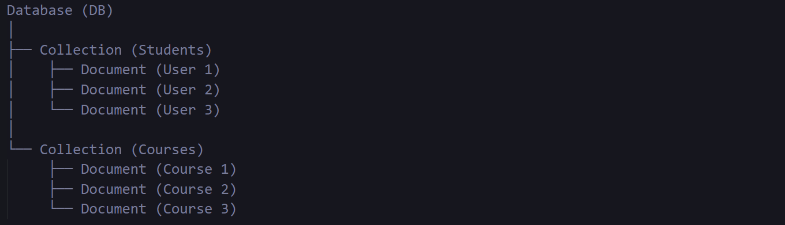
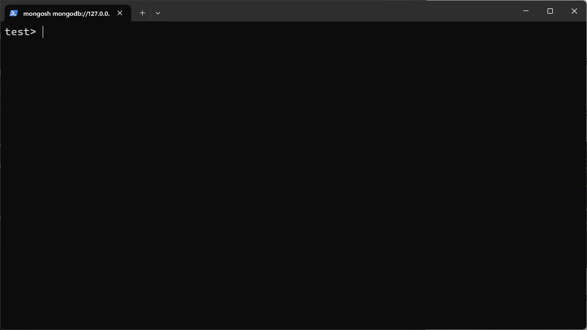
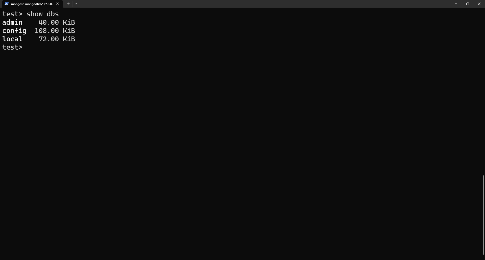
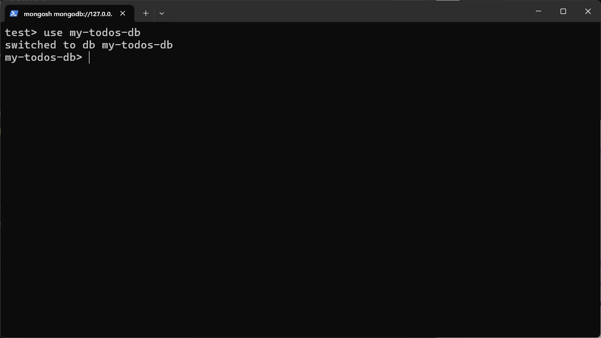
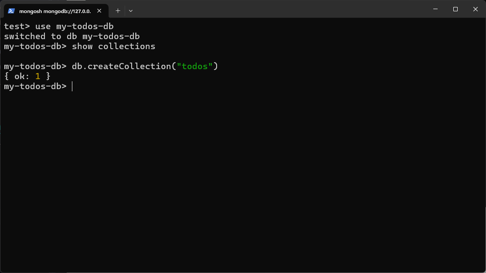
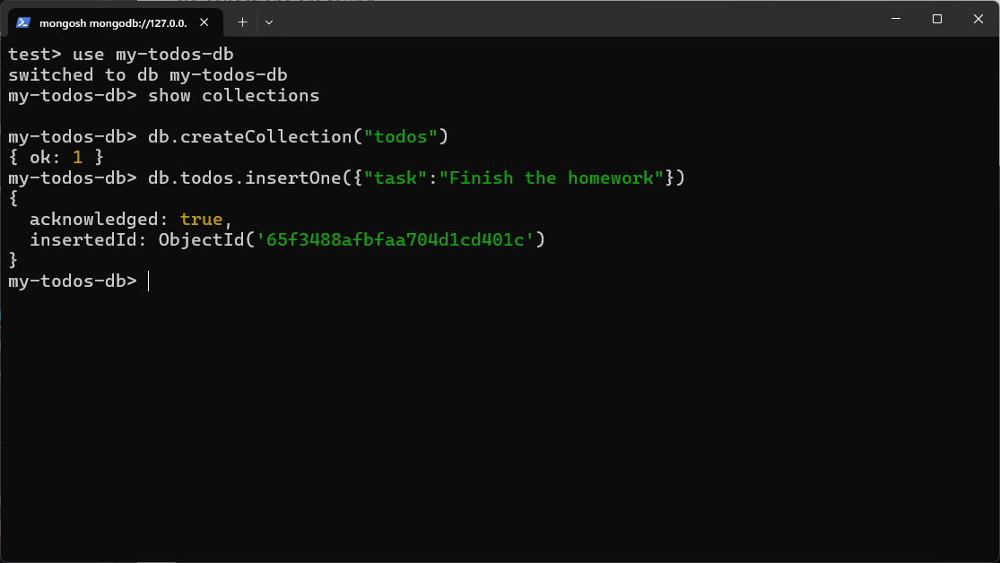
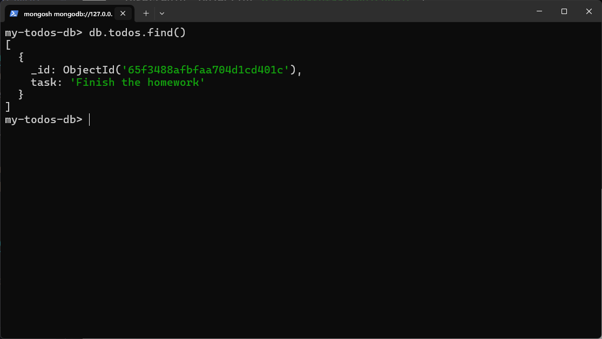

# Record
When we visualize an entity in a tabular form, each row in the table represents a single record or instance of that entity

# Document 
An entity contains multiple number of record/document within a table like structure.

In **MongoDB** each record present within entity table is a document, which is a data structure composed of **field (In ER Diagram this is => Attribute)** and **value** pairs. **MongoDB** documents are similar to JSON objects.
**Example of record in below:**<br>
### IN JSON FORMAT
```json
{
        "uID":4,                         
        "name":"Rimon",            
        "email":"rimon@gmail.com",    
        "password":"4sV@jK!8"         
}
```
### IN JSOLN FORMAT
```json
{
    uID:1,                         
    name:"Rashed",              
    email:"rashed@gmail.com",   
    password:"Xy7#nKp2@"        
}
```
# Collection


A collection is a **group** of multiple JSON-formatted records/documents belonging to a specific entity.

By wrapping all existing JSON-formatted records/documents belonging to a specific entity within an array, we create a collection.


**Example of collection below:**
```json
[
    {
        "uID": 1,
        "name": "Rashed",
        "email": "rashed@gmail.com",
        "password": "Xy7#nKp2@"
    },
    {
        "uID": 2,
        "name": "Jaman",
        "email": "jaman@gmail.com",
        "password": "$L9wYq3r"
    },
    {
        "uID": 3,
        "name": "Raju",
        "email": "raju@gmail.com",
        "password": "6bZ&g#Px"
    },
    {
        "uID": 4,
        "name": "Rimon",
        "email": "rimon@gmail.com",
        "password": "4sV@jK!8"
    }
]
```

# Database

**What is a Database?** 
- Think of a database like a big box where you keep smaller boxes. Each smaller box holds things that are related to each other, like clothes in a drawer.
- It's also like a big bookshelf where each shelf (collection) holds books (documents) on a similar topic.

**Why Do We Need Databases?** 
- They help us keep our stuff organized. Instead of scattering items all over the place, we can group them together neatly.
- Just like how folders on your computer help you find files quickly, databases help us find information efficiently.

**Key Points:**
- **Database:** It's a big box (or bookshelf) holding smaller boxes (or shelves) where we keep related things (or documents).
- **Collections:** These are the smaller boxes (or shelves) inside the big box (or bookshelf), organizing similar items together.
- Databases make it easy to manage and find information when it's all neatly organized.


**Example of DB below:**
```json
[
    [
        {
            "uID": 1,
            "name": "Rashed",
            "email": "rashed@gmail.com",
            "password": "Xy7#nKp2@"
        },
        {
            "uID": 2,
            "name": "Jaman",
            "email": "jaman@gmail.com",
            "password": "$L9wYq3r"
        },
        {
            "uID": 3,
            "name": "Raju",
            "email": "raju@gmail.com",
            "password": "6bZ&g#Px"
        },
        {
            "uID": 4,
            "name": "Rimon",
            "email": "rimon@gmail.com",
            "password": "4sV@jK!8"
        }
    ],
    [
        {
            "cID": 1,
            "name": "HTML",
            "description": "Learn HTML.......",
            "price": "10$"
        },
        {
            "cID": 2,
            "name": "CSS",
            "description": "Learn CSS.......",
            "price": "15$"
        },
        {
            "cID": 3,
            "name": "JS",
            "description": "Learn JavaScript.....",
            "price": "50$"
        },
        {
            "cID": 4,
            "name": "NODE",
            "description": "Learn Node JS......",
            "price": "90$"
        }
    ]
]
```
## Input Format: JSON

For storing new record/document in database first we need to input the new record/document in JSON format
## Storage Format: BSON (Binary JSON)

After we provide input as a new record in JSON format, MongoDB stores the record in BSON format.

**BSON (Binary JavaScript Object Notation)** is a binary representation of JSON data. MongoDB internally converts the JSON input into BSON before storing it in binary format within the database.

### Key Points
- MongoDB takes input records/documents in JSON format.
- Before storing, MongoDB converts JSON to BSON implicitly.
- BSON format is only understanable by machine
- BSON allows for efficient storage and retrieval of data.
- MongoDB utilizes BSON to enable fast querying and manipulation of documents.

# CRUD operation on MongoDB
C => Create
R => Read
U => Update
D => Delete

### Project TODO
Steps:
1. Create Database
2. Create Collection of tasks
3. Todos -> CRUD
   
Open CMD or Terminal then type `mongosh` as a command to run mongosh shell

        
Press `Ctrl+L` to clear all unwanted info


Check is there any existing db present or not by using `show dbs` command

There are three default db present

For creating new database use below command
`use dbname`
if entered db exist then the existing database will be opened in terminal

if there is no database existing in that name then mongosh will create a new database<br>
Creating a database named with **my-todos-db**
so command will be **use my-todos-db**

The **my-todos-db** named database created successfully and opened in the terminal

check is that the database contains any collections
use this command
`show collections`

No collections are found

create new collection
`db.createCollection("collectionName")
`
in this terminal session **db** indicates => **my-todo-db** named Database

**{ok:1}** means **todos** collection created successfully

**insert / add** task to **todos** collection


see all records present in **single** collection within specific db using `db.todos.find()`

here mongodb automatically insterted a new _id when added or inserted new task
So we dont need to add id as a field/attribute explicitly


Practice: 
1) check how many collections present in this db.
2) add another task in todos collection
3)  Check all task in todos collection

| **Operation**                                                  | **Description**                                                                                                                                                 |
|----------------------------------------------------------------|-----------------------------------------------------------------------------------------------------------------------------------------------------------------|
| 1) show dbs                                                    | Display all existing databases in MongoDB.                                                                                                                     |
| 2) use raju-students                                           | Creates a new database named `raju-students` or switches to an existing one with the same name.                                                                 |
| 3) show collections                                            | Shows all collections in the current database.                                                                                                                 |
| 4) db.createCollection("students")                             | Creates a collection named `students` within the current database.                                                                                              |
| 5) db.students.insertOne({"name":"rashed","age":25,"skills":["html","css","js"]}) | Inserts a single record/document into the `students` collection.                                                                                                 |
| 6) db.students.find()                                          | Displays all existing record/documents within the `students` collection.                                                                                         |
| 7) db.students.find().count()                                  | Displays the total number of existing record/documents within the `students` collection.                                                                         |
| 9) db.students.find({"name": "Rimon"})                        | Displays an array of matched records based on the provided name.                                                                                                |
| findOne(findOne only displays the 1st occurrence of record)   |                                                                                                                                                                 |
| 10) db.students.findOne({ "name": "Rimon" })                  | Displays the first occurrence of a record with the specified name field.                                                                                         |
| updateOne(updateOne only updates the 1st occurrence of record)|                                                                                                                                                                 |
| 11) db.students.updateOne({"_id": ObjectId('65f445833b30b500c74babb4')},{$set:{"age":21}}) | Updates the existing field value within a specific existing record or inserts a new field with the given value.                                                  |
| 12) db.students.updateOne({"name": "Rimon"},{$set:{"unknown":21}}) | Inserts a new field and value within the first occurrence of an existing record based on the specified name field.                                               |
| deleteOne(deleteOne only deletes the 1st occurrence of record)|                                                                                                                                                                 |
| 13) db.students.deleteOne({ "name": "Rimon" })                | Deletes existing records based on the specified name field.                                                                                                     |
| 14) db.students.insertMany([...])                             | Inserts multiple record/documents into the `students` collection.                                                                                               |
| 15) db.students.updateMany({},{$set:{"isMarried":false}})     | Inserts the new field `{isMarried: false}` to all existing records or updates the value of `isMarried` for those which already have the `isMarried` field.    |
| 16) db.students.find({"hobbies":"cricket"})                   | Displays an array of records containing "cricket" as a hobby.                                                                                                    |
| 17) db.students.find({},{"name":1})                           | Displays `{name: value, _id: value}` of all records as an array.                                                                                                |
| 18) db.students.find({},{"name":1,"_id":0})                   | Displays `{name: value}` of all records as an array.                                                                                                            |
| 19) db.students.find({"experience.company":"Pathao"})          | Finds all records where the company is "Pathao".                                                                                                                 |
| 20) db.students.find().sort({"age":1})                        | Sorts all records by age in ascending order.                                                                                                                     |
| 21) db.students.find({"age":{$eq: 25}})                       | Fetches records where age equals 25.                                                                                                                            |
| 22) db.students.find({"age":{$ne: 25}})                       | Fetches records where age is not equal to 25.                                                                                                                   |
| 23) db.students.find({"age":{$gte: 25}})                      | Fetches records where age is greater than or equal to 25.                                                                                                        |
| 24) db.students.find({"age":{$lte: 25}})                      | Fetches records where age is less than or equal to 25.                                                                                                          |
| 25) db.students.find({$and:[{"age":{$gte: 20}}, {"age":{$lte: 30}}]}) | Fetches records where age is between 20 and 30.                                                                                                                 |
| 26) db.students.find({$or:[{"age":{$gte: 25}}, {"age":{$lte: 30}}]})  | Fetches records where age is greater than or equal to 25 or less than or equal to 30.                                                                           |
