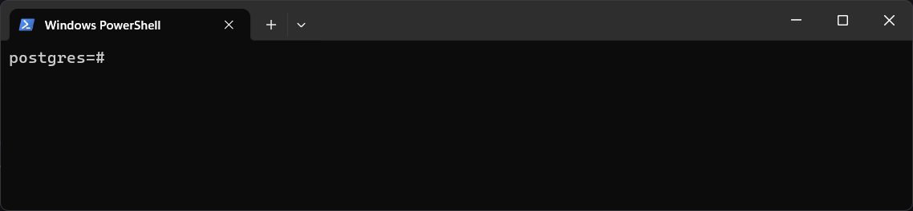
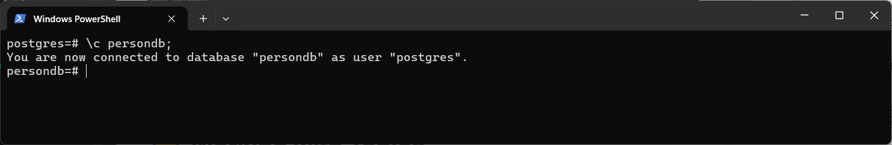

# 🚀 PostgreSQL on Windows

## 1. **Run PostgreSQL** 🖥️
To start using PostgreSQL, open your terminal and enter the following command:
```shell
psql -U username
```
The default username is **postgres**. 

After entering your password, press enter.

---

## 2. **Clear the Terminal** 🧹
To clear the terminal screen, use:
```shell
\! cls;
```


---

## 3. **Check Existing Databases** 📊
You can check existing databases using the terminal with the following commands:
- **Way 1**:
    ```shell
    \l; 
    ```
    
- **Way 2**:
    ```shell
    \list; 
    ```
- **Way 3**:
    ```shell
    SELECT datname FROM pg_database; 
    ```


### Using pgAdmin 4:
1. Select **postgres**.
   
2. Click on **query tools**.
   
3. Execute:
   ```sql
   SELECT datname FROM pg_database;
   ```
   

---

## 4. **Create a New Database** ➕
To create a new database, use:
```sql
CREATE DATABASE name;
```
**Example:**
```sql
CREATE DATABASE persondb;
```


---

## 5. **Switch to Another Database** 🔄
To switch to a different database, use:
```sql
\c name;
```
**Example:**
```sql
\c persondb;
```
- Before switching, the selected database is postgres:
  
- After executing `\c persondb;`, you are now on another database:
  

---

## 6. **Delete an Existing Database** ❌
To delete a database, use:
```sql
DROP DATABASE name;
```
**Example:**
```sql
DROP DATABASE ustc;
```
If you encounter an error:


- Go to pgAdmin 4 and disconnect the 'ustc' database:
  
- Then execute the command again in the terminal:


---

## 🗃️ Working with Tables

### 7. **Create a Table** 🛠️
First we need to switch to our desire database then we will create table

To create a table, use:
```sql
CREATE TABLE person(
    id INT, 
    name VARCHAR(100), 
    city VARCHAR(100)
);
```
here, **VARCHAR(100)** means, name and city field can contain maximum 100 characters.


---

### 8. **Verify Table Creation** ✅
In the terminal (Only):
```sql
\d person;
```


In **pgAdmin 4**:
```sql
SELECT * FROM information_schema.columns WHERE table_name = 'person';
```


---

### 9. **Insert Single Person's Data** 👤
- **Way 1**:
    ```sql
    INSERT INTO person(id, name, city)
    VALUES (101, 'Raju', 'CTG');
    ```
- **Way 2**:
    ```sql
    INSERT INTO person 
    VALUES (101, 'raju', 'CTG');
    ```

---

### 10. **Insert Multiple Persons' Data** 👥
- **Way 1**:
    ```sql
    INSERT INTO person(id, name, city)
    VALUES 
        (102, 'Jaman', 'CTG'), 
        (103, 'Rashed', 'CTG');
    ```
- **Way 2**:
    ```sql
    INSERT INTO person 
    VALUES 
        (102, 'Jaman', 'CTG'), 
        (103, 'Rashed', 'CTG');
    ```

---

### 11. **Read Data from the Person Table** 📖
- To read all columns:
    ```sql
    SELECT * FROM person;
    ```
- To read specific columns:
    ```sql
    SELECT name FROM person;
    ```
- For multiple specific columns:
    ```sql
    SELECT name, city FROM person;
    ```
- For specific id containing row:
    ```sql
    SELECT * FROM person WHERE id=102;
    ```
    ```sql
    SELECT name,city FROM person WHERE id=102;
    ```

---

### 12. **Update Data of a Specific Person** ✏️
To update a person's city:
```sql
UPDATE person
SET city = 'KHULNA'
WHERE id = 101;
```

---

### 13. **Delete a Person's Row** 🗑️
To delete a row:
```sql
DELETE FROM person
WHERE id = 102;
```

---

### 14. **Data Types in PostgreSQL** 📊
**Numeric Types:**
- `INT`
- `DOUBLE PRECISION`
- `FLOAT`
- `DECIMAL`
- `SERIAL`

**String Type:**
- `VARCHAR(limit)`

**Date Type:**
- `DATE`

**Boolean Type:**
- `BOOLEAN`

---

### 15. **Constraints** ⚖️
Common constraints include:
1. **PRIMARY KEY**
2. **NOT NULL**
3. **UNIQUE**
4. **DEFAULT VALUE**
5. **CURRENT_DATE**

---

### **Use of Constraints**
Creating a table with various constraints:
```sql
CREATE TABLE employees(
    emp_id SERIAL PRIMARY KEY,
    fname VARCHAR(10) NOT NULL,
    lname VARCHAR(10) NOT NULL,
    email VARCHAR(25) NOT NULL UNIQUE,
    dept VARCHAR(9),
    salary DECIMAL(10,2) DEFAULT 30000.00,
    hire_date DATE DEFAULT CURRENT_DATE
);
```

---

